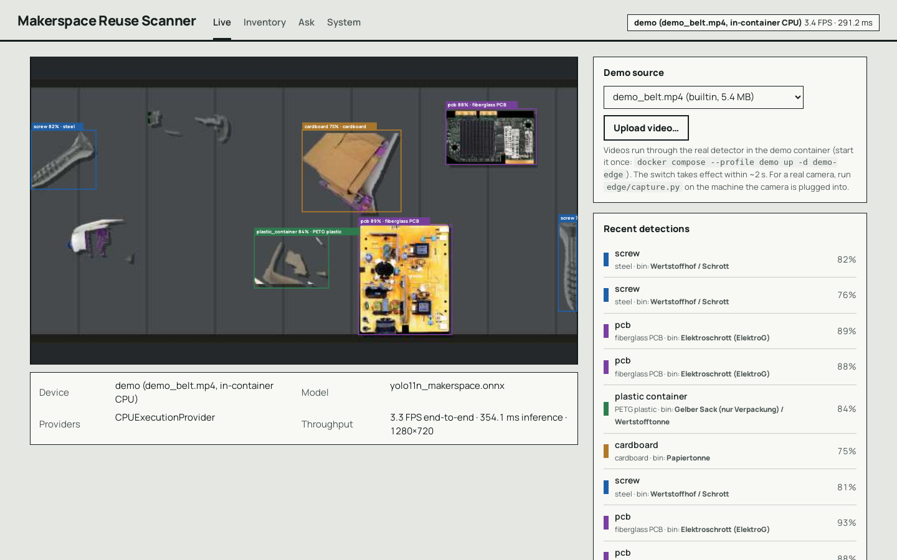
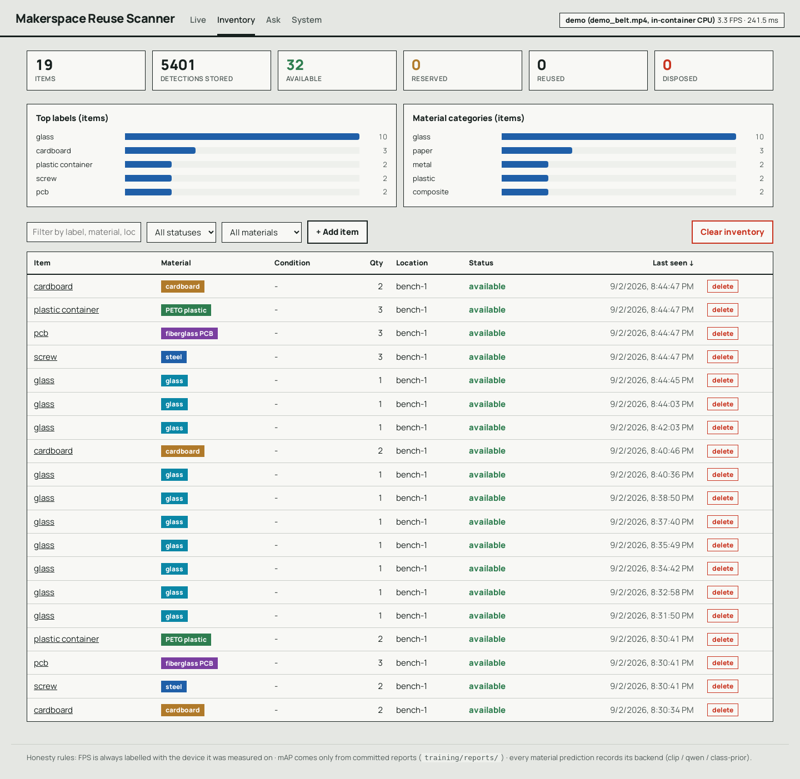
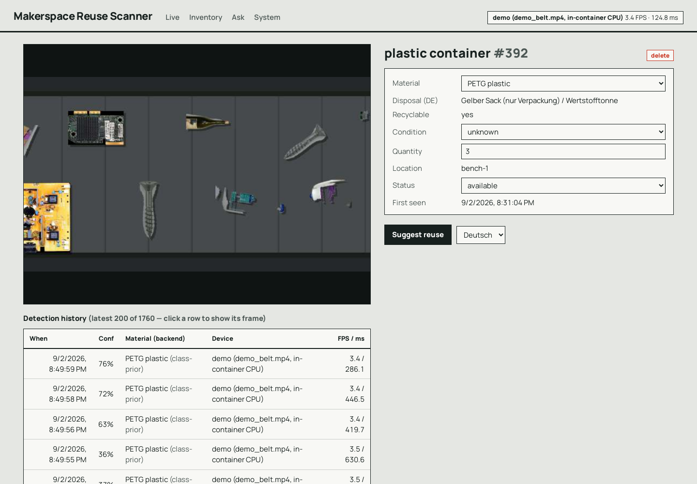
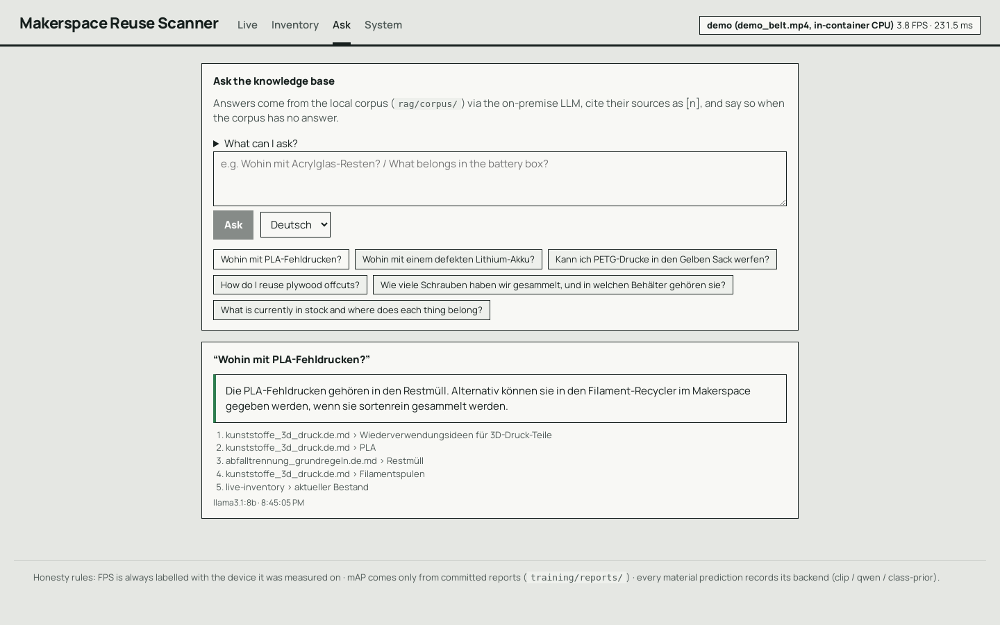

# Makerspace Reuse Scanner

**EN** · A camera at the makerspace bench detects parts and offcuts (screws, PCBs, filament spools, wood, cables …), classifies material and condition with a local vision-language model, keeps a reuse inventory, and answers "how do I reuse or dispose of this?" from a cited, German-language knowledge base - all on-premise.

**DE** · Eine Kamera an der Werkbank erkennt Teile und Reststücke, bestimmt Material und Zustand mit einem lokalen Vision-Language-Modell, führt ein Wiederverwendungs-Inventar und beantwortet „Wie kann ich das wiederverwenden oder entsorgen?" aus einer zitierenden, deutschsprachigen Wissensbasis - vollständig on-premise.

```
Pi 5 / Jetson / webcam --OpenCV--> YOLO11n (ONNX Runtime) --WS--> FastAPI --> PostgreSQL + pgvector
                                        |                          |              ^
                                   crops|                          v              | embeddings
                                        +--> CLIP / Qwen2.5-VL (material)      Ollama (llama3.1, nomic-embed) <-- rag/corpus/*.md
                                                                   |
                                                       React + Vite (live overlay - inventory - item detail - cited suggestions)
```

## Live demo / Live-Demo
- **Hugging Face Space, the real GUI running in your browser**: https://huggingface.co/spaces/pavanyadava07/makerspace-reuse-scanner · this React app built in browser mode (`npm run build:browser`): an in-page shim (`web/src/browser/`) replaces the API and the live socket, the same ONNX detector runs in a Web Worker with onnxruntime-web on the conveyor clip, an uploaded video or the webcam, the inventory uses the server's dedupe rule, and Ask searches the corpus with the API's lexical scoring (passages verbatim with citations; no language model in the browser). Everything else is the unchanged GUI.
- **Detector on the Hub** (ONNX + checkpoint + eval/bench reports + model card): https://huggingface.co/pavanyadava07/makerspace-yolo11n
- **Source**: https://github.com/pavanyadava007/makerspace-reuse-scanner · publish with `python scripts/publish_hf.py --model --static`. A Gradio version with Qwen2.5-7B-Instruct on ZeroGPU writing the cited answers is ready in `deploy/hf_space/` (`--space`; Gradio Spaces need a Hugging Face PRO plan).

## Quick start / Schnellstart
```bash
make deploy        # = scripts/deploy.sh: .env → compose up --build (GPU override if present) → pull Ollama models once → seed → smoke test
make smoke         # re-check a running deployment through the web proxy (REST, WebSocket upgrade, CRUD, cited answer)
```
Step by step, if you prefer:
```bash
cp .env.example .env
docker compose up -d --build                     # db, ollama, api (runs migrations), web → http://localhost:8080  (Compose v2)
#   add `-f docker-compose.yml -f docker-compose.gpu.yml` to give Ollama the NVIDIA GPU
docker compose exec ollama ollama pull llama3.1:8b
docker compose exec ollama ollama pull nomic-embed-text
make seed                                        # materials + RAG corpus
python scripts/simulate_edge.py                  # demo without camera/model → boxes + inventory appear
# conveyor-belt demo through the REAL detector (after training/exporting a model):
#   python scripts/make_belt_video.py && docker compose --profile demo up -d --build demo-edge
# edge node (laptop webcam):  pip install -r edge/requirements.txt && cd edge && EDGE_MODEL=../models/yolo11n_makerspace.onnx EDGE_CLASSES=../models/classes.yaml python capture.py
# edge node (Pi 5 / Jetson):  docker compose --profile edge up pi-edge
```
**Detector v0-public.** No makerspace photos exist yet, so the committed model is trained on public data assembled by
`training/build_public_dataset.py` (LVIS, TACO, TrashNet, a cropped-PCB set, MVTec AD screws + train-only copy-paste composites):
9 of the 15 classes - screw, nut_bolt, pcb, motor, battery, tool, plastic_container, cardboard, glass. The other 6 (filament_spool,
wood_offcut, cable, 3d_print_part, acrylic_sheet, metal_profile) have **no public detection data** and stay empty until own photos are
added. Counts and licences: `training/dataset/SOURCES.md`; measured mAP: `training/reports/`. Pipeline: `make dataset train eval export`.
Every `EDGE_*` variable in `.env.example` overrides the same key in `edge/config.yaml` (`edge/settings.py`).

**Material stage in Docker.** The default `api` image ships `vlm/` and `rag/` but *not* PyTorch, so material comes from the labelled
`class-prior` fallback. Build with `WITH_VLM=1 docker compose build api` to add CPU torch + open_clip (≈ 1 GB) and get `clip-vitb32`
predictions; Qwen2.5-VL needs a GPU host with the CUDA wheels and `transformers`. The backend actually used is stored per detection.

## Connect a webcam or a video (the edge node runs where the camera is)
No makerspace weights ship yet, so use the COCO-pretrained stand-in: `models/yolo11n_coco.onnx` + `models/classes_coco.yaml`
(export it with `cd training && python -c "from ultralytics import YOLO; YOLO('yolo11n.pt').export(format='onnx', imgsz=640, opset=17, dynamic=False)"`).
It sees everyday objects (bottle, cup, scissors, cell phone, book …); `api/app/services/material.py` bridges a few of them to materials.

```bash
# on the machine with the camera (laptop): needs edge/ and models/ from this repo, Python ≥ 3.10
pip install -r edge/requirements.txt
cd edge
API_URL=http://localhost:8000 EDGE_MODEL=../models/yolo11n_coco.onnx EDGE_CLASSES=../models/classes_coco.yaml \
EDGE_CAMERA=0 python capture.py                       # 0 = first webcam; also /dev/video1, rtsp://…, or a video file
#   video file instead of a camera (looped):  EDGE_CAMERA=/path/to/clip.mp4 …
#   API on another host (e.g. this EC2 box):  API_URL=http://<host>:8000  - through VS Code, forward port 8000 and keep localhost
```
The Live tab shows the frame with boxes as soon as the first `frame` message arrives; items land in the Inventory tab within a second.

## Repository
| Path | Layer | Notes |
|---|---|---|
| `edge/` | Edge capture | OpenCV loop, ONNX Runtime with TensorRT→CUDA→CPU fallback, `bench.py` writes device-labelled FPS to `edge/results/` |
| `training/` | Detector | YOLO11n fine-tune, Label Studio config + converter, `eval_report.py` (only source of mAP numbers) |
| `vlm/` | Material attribute | Zero-shot CLIP (default), Qwen2.5-VL-3B when a GPU ≥ 6 GB is present |
| `api/` | Backend + DB | FastAPI REST + WebSocket, SQLAlchemy 2.0, Alembic, pgvector, pytest (CRUD, WS ingest + dedupe, RAG with mocked Ollama) |
| `web/` | Frontend | React 18 + Vite + TypeScript, no UI framework: live overlay + device/model panel, inventory with stat tiles, bar lists, filters, sorting, add/delete, item detail with clickable detection history, an Ask page for cited knowledge-base answers, System page; `src/browser/` = backend-free build for static hosting (in-browser edge node + API shim) |
| `rag/` | Knowledge | DE/EN corpus, chunk-by-heading ingest, hybrid retrieval (pgvector + Postgres full-text), cited answers, material↔process graph expansion; `rag/eval/` = 25 hand-verified questions + runner → `rag/eval/reports/` |
| `scripts/` | Ops & demo | `deploy.sh` (one-command deployment), `smoke.sh` (end-to-end check), `publish_hf.py` (model repo + Space), `simulate_edge.py`, belt/slideshow demo-video renderers |
| `deploy/` | Hugging Face | `hf_static/` card of the free static Space (the browser-mode GUI build), `hf_space/` Gradio app (ZeroGPU Qwen2.5-7B answers, PRO plan), model card |
| `docs/` | PM & decisions | Arbeitspakete, Meilensteine, 4 Statusberichte (DE), EN mirrors, 4 ADRs, demo script, `screenshots/` |

## API
`GET /api/items` · `GET/PATCH/DELETE /api/items/{id}` · `POST /api/items` · `GET /api/materials` · `GET /api/stats` · `GET /api/detections` · `GET /api/images/{id}` · `POST /api/ask` · `POST /api/items/{id}/suggest?lang=de|en` · `GET /api/model` (detector card from the committed eval report) · `GET /api/demo` · `POST /api/demo/select|upload` · `POST /api/admin/reset` · `WS /ws/edge` (edge → API) · `WS /ws/live` (API → browser). OpenAPI at `/docs`.

## Screenshots (2026-09-02, conveyor demo running in the `demo-edge` container)
| Live | Inventory |
|---|---|
|  |  |
| **Item detail** | **Ask** |
|  |  |

The **System** page (`docs/screenshots/system.png`) shows the detector card built from `training/reports/eval_*.json`, the dedupe rule, where every kind of data lives, and how the assistant grounds its answers.

## Honesty rules / Ehrlichkeitsregeln
1. Every FPS figure carries the device it was measured on (`edge/device.py`).
2. mAP is reported only from the held-out test split by `eval_report.py`; reports are committed, never edited.
3. Every material prediction stores its backend (`clip-vitb32`, `qwen2.5-vl-3b`, or `class-prior`).
4. RAG answers cite chunks; if the corpus is insufficient the model must say so.
5. RAG quality is reported only by `rag/eval/run_rag_eval.py` into `rag/eval/reports/` (answers printed verbatim); never edited by hand.

## Development
`python scripts/simulate_edge.py` (demo without camera/model) · `make test` · `make lint` · `make bench` · CI: ruff, pytest against a pgvector service, Vite build.

## Status
v0.4 - see `docs/de/Meilensteine.md` and `docs/de/Statusbericht_2026-09-02.md`. Whole stack deploys with one command and is checked by
`scripts/smoke.sh`; detector, edge bench and RAG each have a committed measurement. Known gaps: no multi-object tracker (dedupe is
time-window based - an item is one label at one location seen within 20 s of its last sighting; quantity = most same-class boxes in a single
frame), single-process WebSocket hub, 6 of 15 detector classes have no data yet and `battery`/`tool` are unusable, no Pi 5 measurement,
weights/ONNX/demo videos are reproducible from `make dataset train eval export` but gitignored.

## Verification log
What was actually run, on what. Nothing here is a claim about the makerspace detector's accuracy.

| Date | Machine | Gate | Result |
|---|---|---|---|
| 2026-09-01 | x86_64 + NVIDIA L4, Python 3.10, Postgres 16 + pgvector in Docker | `ruff check` · `edge/pytest` (3) · `api/pytest` (11, incl. WS ingest/dedupe and RAG with mocked Ollama) · `npm run build` (tsc + vite) · `docker compose build api web` | all green |
| 2026-09-02 | headless Chromium | GUI v0.4: all four pages screenshotted and reviewed; material palette validated for CVD/contrast (gray "other" → teal `#0B87A6`); tsc strict + vite build green | shipped |
| 2026-09-02 | NVIDIA L4 | v0-public: `build_public_dataset.py` → `train.py` (80 epochs) → `eval_report.py` on the held-out test split → `export_onnx.py` → `bench.py` | measured results in `training/reports/eval_2026-09-02.md` and `edge/results/`; weaknesses section written after confusion-matrix inspection |
| 2026-09-01 | same | pipeline smoke: `train.py` (1 epoch, **synthetic** rectangles, CPU) → `eval_report.py` → `export_onnx.py` (static 640, opset 17, output `1×19×8400`) → `edge/bench.py` + `detector.py` on the exported graph | runs end-to-end; mAP/FPS from this run are meaningless (synthetic data) and were **not** committed |
| 2026-09-01 | same | `docker compose up db api web` → `app.seed` → `scripts/simulate_edge.py` → REST (`/api/items`, `/api/stats`, `/api/images/{id}`, PATCH) and `/ws/live` through the nginx proxy | items created + deduped, images served, live frames reach the browser socket |
| 2026-09-02 | same host | gates re-run after the changes below: `ruff` · `edge/pytest` (3) · `api/pytest` (19, incl. hybrid-retrieval and eval-scorer tests) · `npm run build` · `docker compose up -d --build api web` | all green |
| 2026-09-02 | L4, Ollama in Docker | `rag/eval/run_rag_eval.py` (25 questions) against the live stack: first with vector-only retrieval (`reports/rag_eval_2026-09-02_vector-only.md`), then after adding the full-text leg (`reports/rag_eval_2026-09-02.md`) | two German questions whose key chunk was missed by embeddings are found now; one English answer and one refusal wording remain documented misses; answers are in the reports verbatim |
| 2026-09-02 | same | `scripts/smoke.sh` through nginx (web, REST, WebSocket upgrade 101, CRUD, cited answer) · Playwright screenshots of all five pages | all checks passed; `docs/screenshots/` |
| 2026-09-01 | same, Ollama in Docker on the L4 (`docker-compose.gpu.yml`) | `app.rag_ingest` (21 chunks / 5 docs) → `POST /api/ask` (DE + EN) and `POST /api/items/{id}/suggest` with `nomic-embed-text` + `llama3.1:8b` | cited answers with `[n]`; EN question retrieved only EN chunks; out-of-corpus question was declined ("keine Hinweise im Kontext"); first call ≈ 50 s (model load), then ≈ 7 s |

Fixed while verifying (all covered by tests now): the WebSocket ingest test hung with current Starlette (needs one shared portal, `conftest.py`);
dedupe never refreshed `updated_at` (an object in view > 20 s became a second item) and ignored per-frame counts; `GET /api/images/{id}`
500'd on unknown ids; `EDGE_MODEL`/`EDGE_MIN_CONF` were documented but never read; `vlm/` and `rag/` were outside the API Docker build
context (GraphRAG and CLIP silently disabled in Compose); `train.py`'s relative `project="runs"` is nested under `runs/detect/` by
Ultralytics ≥ 8.4, so `eval_report.py`/`export_onnx.py` could not find `best.pt`; chunks were embedded without nomic's
`search_document:`/`search_query:` prefixes and without their heading - "Wohin mit Sperrholzresten?" missed the Altholz chunk that names
Sperrholz; with prefixes it ranks first. Warm answers on an L4: ≈ 1-2 s; `OLLAMA_KEEP_ALIVE=-1` keeps the model resident.


Lizenz: MIT · Author: Pavan Yadav Annappa, Frankfurt am Main
